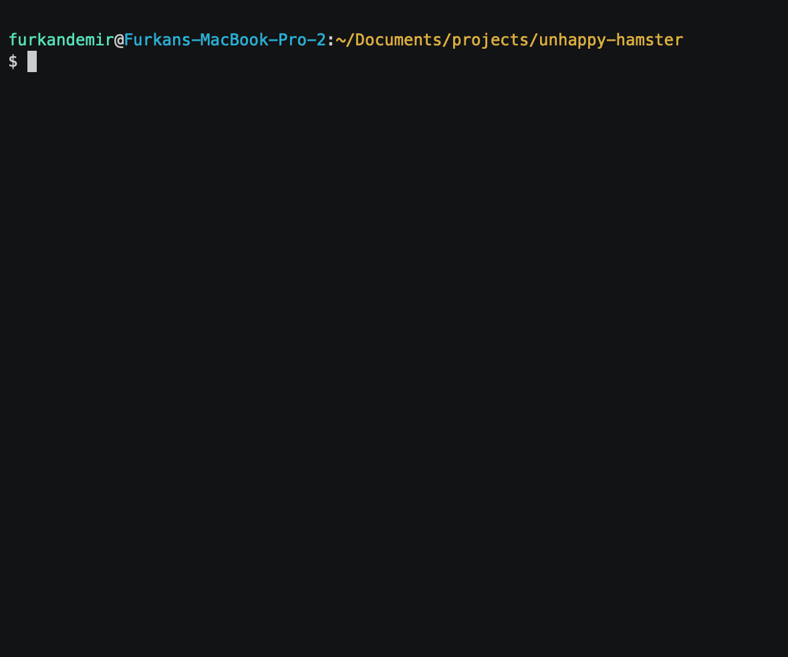

# Unhappy Hamster - Product/Service Feedback Review Sentiment Analyzer

_Are my customers happy? Let's try to find out!_

Unhappy Hamster is a command-line tool that allows you to analyze customer sentiment in product reviews. With this tool, you can quickly get how happy or unhappy customers are based on their feedback. It uses Hugging Face's [Turkish Sentiment Analysis Model](https://huggingface.co/emre/turkish-sentiment-analysis) to analyze the sentiment of each review and provide a score indicating the level of happiness. The score ranges from 0 to 1, where 0 is very unhappy and 1 is very happy. Notr is a special case where the score is 0.5.

<!-- k -->



## Features

- Analyze product reviews to determine customer sentiment.
- Provide a sentiment score for each review, indicating the level of happiness.
- Provide a bulk sentiment score for all reviews, indicating the overall level of happiness(todo)

### Development

```bash
deno run --allow-net main.ts

```

## Disclaimer

Please note that the sentiment analysis may not be perfect and should be used as a reference for making important decisions.

## References

- [Sentiment Analysis](https://en.wikipedia.org/wiki/Sentiment_analysis)
- [Sentiment Analysis with Go](https://towardsdatascience.com/sentiment-analysis-with-go-8dfbdfb88d1d)
- [Türkçe Duygu Analizi Veriseti](https://huggingface.co/datasets/winvoker/turkish-sentiment-analysis-dataset)
- [Türkçe Duygu Analizi Modeli](https://huggingface.co/emre/turkish-sentiment-analysis)

## License

Unhappy Hamster is open-source and distributed under the [MIT License](https://opensource.org/licenses/MIT).

<link rel="alternate" type="application/x-asciicast" href="/my/ascii.cast">
# unhappy-hamster
